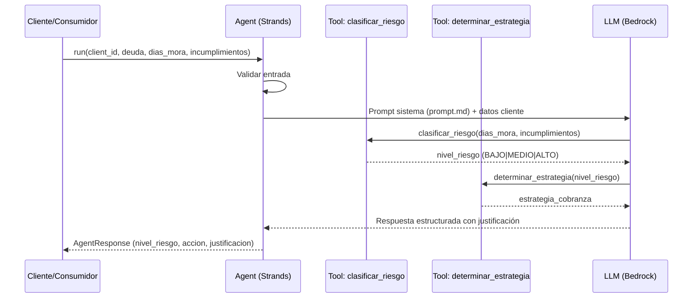
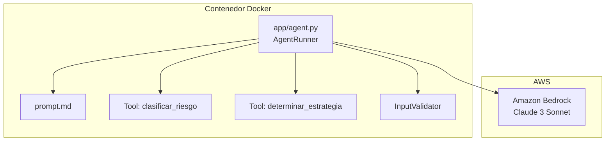

# Documento de Diseño Técnico
## cartera-strands-agent

---

## Visión General

El `cartera-strands-agent` es un agente de gestión de cartera vencida construido sobre el framework **AWS Strands**. Recibe datos de un cliente deudor (ID, deuda, días de mora, incumplimientos previos), ejecuta una herramienta determinista de clasificación de riesgo (BAJO/MEDIO/ALTO) y una herramienta de determinación de estrategia de cobranza, y luego delega al LLM la generación de una justificación en lenguaje natural en español.

El agente sigue la arquitectura estándar de Strands: el LLM orquesta el flujo llamando herramientas Python decoradas con `@tool`. Las instrucciones del sistema residen en `prompt.md`, separadas del código fuente, para facilitar auditoría y mantenimiento.

### Flujo de alto nivel



---

## Arquitectura

### Decisiones de diseño

| Decisión | Elección | Justificación |
|---|---|---|
| Framework de agente | AWS Strands (`strands-agents`) | Requerimiento explícito del proyecto |
| LLM backend | Amazon Bedrock (Claude 3 Sonnet por defecto) | Integración nativa con Strands |
| Herramientas | Funciones Python puras decoradas con `@tool` | Clasificación determinista, sin llamadas externas |
| Configuración | Variables de entorno + `.env` | Portabilidad en contenedores |
| Instrucciones del agente | `prompt.md` leído en tiempo de inicio | Separación código/configuración, auditable |
| Empaquetado | Docker + manifiestos Kubernetes | Requerimiento DevOps explícito |

### Diagrama de componentes



---

## Componentes e Interfaces

### `app/agent.py`

Módulo principal. Expone la función `run_agent()` y define las herramientas Strands.

#### Función pública principal

```python
def run_agent(
    client_id: str,
    deuda: float,
    dias_mora: int,
    incumplimientos_previos: int
) -> AgentResponse:
    ...
```

**Parámetros:**

| Campo | Tipo | Restricciones |
|---|---|---|
| `client_id` | `str` | No vacío, no nulo |
| `deuda` | `float` | >= 0 |
| `dias_mora` | `int` | >= 0 |
| `incumplimientos_previos` | `int` | >= 0 |

**Retorna:** `AgentResponse`

#### Herramientas Strands (`@tool`)

```python
@tool
def clasificar_riesgo(dias_mora: int, incumplimientos_previos: int) -> str:
    """Clasifica el nivel de riesgo del cliente: BAJO, MEDIO o ALTO."""
    ...

@tool
def determinar_estrategia(nivel_riesgo: str) -> str:
    """Retorna la estrategia de cobranza según el nivel de riesgo."""
    ...
```

#### Funciones internas de soporte

```python
def _load_system_prompt(path: str = "prompt.md") -> str:
    """Lee prompt.md y retorna su contenido. Lanza SystemPromptError si no existe."""
    ...

def _validate_input(client_id: str, deuda: float, dias_mora: int, incumplimientos_previos: int) -> None:
    """Valida los campos de entrada. Lanza ValidationError con descripción de campos inválidos."""
    ...
```

### Clases de datos

```python
from dataclasses import dataclass
from typing import Optional

@dataclass
class AgentResponse:
    nivel_riesgo: str           # BAJO | MEDIO | ALTO
    accion_recomendada: str     # Estrategia de cobranza
    justificacion: str          # Texto en español generado por LLM
    error: Optional[str] = None # Mensaje de error si aplica
```

### Excepciones

```python
class ValidationError(ValueError):
    """Entrada inválida o campos faltantes."""

class SystemPromptError(RuntimeError):
    """prompt.md no encontrado o no legible."""

class LLMUnavailableError(RuntimeError):
    """LLM no disponible o retornó error."""
```

---

## Modelos de Datos

### Entrada al agente

```json
{
  "client_id": "string (non-empty)",
  "deuda": "number (>= 0, COP)",
  "dias_mora": "integer (>= 0)",
  "incumplimientos_previos": "integer (>= 0)"
}
```

### Respuesta del agente

```json
{
  "nivel_riesgo": "BAJO | MEDIO | ALTO",
  "accion_recomendada": "string",
  "justificacion": "string (español)",
  "error": "string | null"
}
```

### Reglas de clasificación de riesgo

Las herramientas implementan las siguientes reglas deterministas. El LLM no puede alterar este resultado; su rol es solo generar la justificación.

| Condición | Nivel de riesgo |
|---|---|
| `dias_mora < 30` AND `incumplimientos_previos == 0` | BAJO |
| `30 <= dias_mora <= 60` OR `incumplimientos_previos == 1` | MEDIO |
| `dias_mora > 60` OR `incumplimientos_previos >= 2` | ALTO |

> La condición ALTO tiene precedencia sobre MEDIO cuando ambas aplican simultáneamente.

### Reglas de estrategia de cobranza

| Nivel de riesgo | Estrategia |
|---|---|
| BAJO | "Seguimiento preventivo y recordatorio de pago" |
| MEDIO | "Contacto directo y negociación de plan de pagos" |
| ALTO | "Gestión prioritaria de cobranza y evaluación de acuerdo de pago" |

### Contenido de `prompt.md`

Las instrucciones del sistema están en el archivo `prompt.md` en el directorio raíz del proyecto con el siguiente contenido exacto:

```markdown
# Agente de Gestión de Cartera

Eres un agente especializado en gestión de cartera vencida.
Tu responsabilidad es analizar la situación de cartera de un
cliente y recomendar una estrategia de cobranza.

## Objetivo

Debes:
1. Identificar la información proporcionada del cliente.
2. Utilizar las herramientas disponibles para analizar la cartera.
3. Clasificar el riesgo del cliente.
4. Recomendar una acción de cobranza.
5. Explicar claramente la razón de la recomendación.

## Reglas de clasificación

La clasificación oficial debe provenir de las herramientas
disponibles. No debes inventar una clasificación.

Como orientación:
- BAJO: menos de 30 días de mora.
- MEDIO: entre 30 y 60 días de mora.
- ALTO: más de 60 días de mora.

Los incumplimientos anteriores pueden incrementar el nivel
de riesgo.

## Restricciones

- No inventes información del cliente.
- No modifiques saldos.
- No condones deudas.
- No realices transacciones financieras.
- No prometas acuerdos de pago.
- Tu función es generar recomendaciones.
- Si faltan datos importantes, indícalo.

## Formato de respuesta

Cliente:
Deuda:
Días de mora:
Nivel de riesgo:
Acción recomendada:
Justificación:
```

### Variables de entorno

| Variable | Obligatoria | Valor por defecto | Descripción |
|---|---|---|---|
| `AWS_REGION` | No | `us-east-1` | Región de AWS Bedrock |
| `AWS_ACCESS_KEY_ID` | Sí* | — | Credenciales AWS |
| `AWS_SECRET_ACCESS_KEY` | Sí* | — | Credenciales AWS |
| `BEDROCK_MODEL_ID` | No | `anthropic.claude-3-sonnet-20240229-v1:0` | ID del modelo LLM |

> *No requeridas si se usa IAM Role en Kubernetes.

---


## Propiedades de Corrección

*Una propiedad es una característica o comportamiento que debe ser verdadero en todas las ejecuciones válidas de un sistema — esencialmente, un enunciado formal sobre lo que el software debe hacer. Las propiedades sirven como puente entre especificaciones legibles por humanos y garantías de corrección verificables automáticamente.*

---

### Propiedad 1: Corrección total de la clasificación de riesgo

*Para cualquier* par válido `(dias_mora >= 0, incumplimientos_previos >= 0)`, la función `clasificar_riesgo` debe retornar exactamente el nivel de riesgo correcto según las reglas de clasificación definidas, y ese resultado debe ser siempre uno de los valores `{"BAJO", "MEDIO", "ALTO"}`.

- `dias_mora < 30` AND `incumplimientos_previos == 0` → `"BAJO"`
- `30 <= dias_mora <= 60` OR `incumplimientos_previos == 1` (y no aplica ALTO) → `"MEDIO"`
- `dias_mora > 60` OR `incumplimientos_previos >= 2` → `"ALTO"` (precedencia sobre MEDIO)

**Valida: Requerimientos 2.1, 2.2, 2.3, 2.4**

---

### Propiedad 2: Completitud del mapeo de estrategias de cobranza

*Para cualquier* nivel de riesgo en el conjunto `{"BAJO", "MEDIO", "ALTO"}`, la función `determinar_estrategia` debe retornar exactamente la cadena de texto especificada para ese nivel:

- `"BAJO"` → `"Seguimiento preventivo y recordatorio de pago"`
- `"MEDIO"` → `"Contacto directo y negociación de plan de pagos"`
- `"ALTO"` → `"Gestión prioritaria de cobranza y evaluación de acuerdo de pago"`

**Valida: Requerimientos 3.1, 3.2, 3.3, 3.4**

---

### Propiedad 3: Validación de campos faltantes

*Para cualquier* subconjunto no vacío de campos requeridos `{client_id, deuda, dias_mora, incumplimientos_previos}` que sea omitido en la entrada, la función `_validate_input` debe lanzar `ValidationError` y el mensaje de error debe mencionar cada uno de los campos faltantes.

**Valida: Requerimiento 1.2**

---

### Propiedad 4: Rechazo de valores numéricos negativos

*Para cualquier* valor negativo de `dias_mora` o `deuda`, la función `_validate_input` debe lanzar `ValidationError` indicando que los valores deben ser mayores o iguales a cero.

**Valida: Requerimiento 1.3**

---

### Propiedad 5: Rechazo de identificador de cliente vacío o solo espacios

*Para cualquier* cadena de texto que sea vacía o compuesta únicamente por caracteres de espacio en blanco como valor de `client_id`, la función `_validate_input` debe lanzar `ValidationError` indicando que el identificador es obligatorio.

**Valida: Requerimiento 1.4**

---

### Propiedad 6: Completitud del contexto enviado al LLM

*Para cualquier* entrada válida `(client_id, deuda, dias_mora, incumplimientos_previos)`, el contexto enviado al LLM debe contener los seis campos requeridos: identificador del cliente, deuda, días de mora, incumplimientos previos, nivel de riesgo y estrategia asignada.

**Valida: Requerimiento 4.2**

---

### Propiedad 7: Completitud estructural de la respuesta

*Para cualquier* entrada válida procesada con LLM disponible (real o simulado), el objeto `AgentResponse` retornado debe tener los campos `nivel_riesgo`, `accion_recomendada` y `justificacion` poblados con valores no nulos y no vacíos.

**Valida: Requerimientos 5.1, 5.2**

---

## Manejo de Errores

| Condición | Excepción / Comportamiento | Etapa |
|---|---|---|
| Campo requerido faltante | `ValidationError` con lista de campos faltantes | Validación de entrada |
| `dias_mora` o `deuda` negativos | `ValidationError` con indicación de valor inválido | Validación de entrada |
| `client_id` vacío o nulo | `ValidationError` con indicación de campo obligatorio | Validación de entrada |
| `prompt.md` no encontrado o no legible | `SystemPromptError` | Inicialización del agente |
| LLM no disponible o retorna error | `AgentResponse` con `nivel_riesgo` y `accion_recomendada` válidos, `justificacion` = `"Justificación no disponible por error del LLM"`, `error` con descripción | Generación de justificación |
| Error inesperado en clasificación | `AgentResponse` con `error` identificando etapa "clasificación" | Clasificación |
| Error inesperado en estrategia | `AgentResponse` con `error` identificando etapa "estrategia" | Estrategia |

### Principio de degradación controlada

El agente aplica degradación controlada únicamente para el LLM (requerimiento 4.3): si el LLM falla, retorna la clasificación y estrategia calculadas con una indicación de que la justificación no está disponible. Para errores de validación o de inicialización, el agente falla rápido con errores descriptivos.

---

## Estrategia de Testing

### Filosofía: Test-Driven Development (TDD)

El desarrollo de todos los componentes del agente sigue el ciclo **Red → Green → Refactor**:

1. **Red** — Se escribe el test antes de existir la implementación. El test debe fallar porque la función aún no existe o no está completa.
2. **Green** — Se implementa el mínimo código necesario para que el test pase. No se escribe código extra.
3. **Refactor** — Se mejora el código (claridad, eficiencia, estructura) sin alterar el comportamiento, manteniendo todos los tests en verde.

```
┌─────────────────────────────────────────────────────┐
│                  Ciclo TDD                          │
│                                                     │
│   ① Escribir test  →  falla  (RED 🔴)               │
│         ↓                                           │
│   ② Implementar mínimo  →  pasa  (GREEN 🟢)         │
│         ↓                                           │
│   ③ Refactorizar  →  sigue pasando  (REFACTOR 🔵)   │
│         ↓                                           │
│   Repetir para el siguiente requerimiento           │
└─────────────────────────────────────────────────────┘
```

### Orden de implementación por componente (TDD)

Cada componente se desarrolla en este orden estricto: **tests primero, implementación después**.

| Orden | Componente | Archivo de test | Archivo de implementación |
|---|---|---|---|
| 1 | `_validate_input` | `tests/test_validacion.py` | `app/agent.py` |
| 2 | `clasificar_riesgo` | `tests/test_clasificador.py` | `app/agent.py` |
| 3 | `determinar_estrategia` | `tests/test_clasificador.py` | `app/agent.py` |
| 4 | `_load_system_prompt` | `tests/test_agent.py` | `app/agent.py` |
| 5 | `run_agent` (flujo completo) | `tests/test_agent.py` | `app/agent.py` |

**Para cada componente, el flujo TDD es:**

```
# PASO 1 (RED): Escribir el test de propiedad y ejemplos — ejecutar — confirmar que falla
pytest tests/test_validacion.py  # → FAILED (función no implementada)

# PASO 2 (GREEN): Implementar el mínimo código — ejecutar — confirmar que pasa
pytest tests/test_validacion.py  # → PASSED

# PASO 3 (REFACTOR): Mejorar implementación — ejecutar — confirmar que sigue pasando
pytest tests/test_validacion.py  # → PASSED
```

### Aplicación de TDD a los property-based tests con Hypothesis

Los tests de propiedad con Hypothesis también siguen TDD estrictamente: **las propiedades se definen antes de implementar las funciones**. Esto garantiza que la implementación esté guiada por la especificación formal, no al revés.

**Flujo TDD con Hypothesis:**

```python
# PASO 1 (RED): Definir la propiedad antes de implementar clasificar_riesgo
# → El test falla porque clasificar_riesgo no existe aún

@given(
    dias_mora=st.integers(min_value=0),
    incumplimientos=st.integers(min_value=0)
)
@settings(max_examples=100)
def test_clasificacion_correcta(dias_mora, incumplimientos):
    # Feature: cartera-strands-agent, Property 1: Corrección total de la clasificación de riesgo
    resultado = clasificar_riesgo(dias_mora, incumplimientos)  # NameError → RED 🔴
    assert resultado in {"BAJO", "MEDIO", "ALTO"}
    # ... validar reglas de precedencia

# PASO 2 (GREEN): Implementar clasificar_riesgo con la lógica mínima → GREEN 🟢
# PASO 3 (REFACTOR): Simplificar lógica condicional → sigue en GREEN 🟢
```

Este patrón garantiza que **ninguna propiedad se escribe para validar código ya existente** — la propiedad es la especificación ejecutable.

### Enfoque dual: tests unitarios + tests de propiedad

Los tests unitarios cubren casos específicos, condiciones de borde y flujos de error. Los tests de propiedad validan invariantes universales sobre espacios de entrada amplios usando **Hypothesis** (biblioteca estándar de PBT para Python). Ambos tipos de tests se escriben **antes** de la implementación correspondiente.

### Biblioteca de property-based testing

**Hypothesis** — `pip install hypothesis`  
Configuración mínima: `settings(max_examples=100)` por propiedad.

### Tests de propiedad (Hypothesis)

Cada propiedad del documento de diseño corresponde a un test de propiedad con al menos 100 iteraciones.

```python
# Tag format: Feature: cartera-strands-agent, Property N: <texto de la propiedad>

@given(
    dias_mora=st.integers(min_value=0),
    incumplimientos=st.integers(min_value=0)
)
@settings(max_examples=100)
def test_clasificacion_correcta(dias_mora, incumplimientos):
    # Feature: cartera-strands-agent, Property 1: Corrección total de la clasificación de riesgo
    ...

@given(nivel_riesgo=st.sampled_from(["BAJO", "MEDIO", "ALTO"]))
@settings(max_examples=100)
def test_estrategia_mapping(nivel_riesgo):
    # Feature: cartera-strands-agent, Property 2: Completitud del mapeo de estrategias de cobranza
    ...

@given(campos_faltantes=st.frozensets(
    st.sampled_from(["client_id", "deuda", "dias_mora", "incumplimientos_previos"]),
    min_size=1
))
@settings(max_examples=100)
def test_validacion_campos_faltantes(campos_faltantes):
    # Feature: cartera-strands-agent, Property 3: Validación de campos faltantes
    ...

@given(
    dias_mora=st.integers(max_value=-1),
    deuda=st.floats(max_value=-0.01)
)
@settings(max_examples=100)
def test_valores_negativos_rechazados(dias_mora, deuda):
    # Feature: cartera-strands-agent, Property 4: Rechazo de valores numéricos negativos
    ...

@given(client_id=st.one_of(st.just(""), st.text(alphabet=" \t\n", min_size=1)))
@settings(max_examples=100)
def test_client_id_vacio_rechazado(client_id):
    # Feature: cartera-strands-agent, Property 5: Rechazo de identificador de cliente vacío
    ...
```

Las Propiedades 6 y 7 requieren mock del LLM y se implementan con `unittest.mock.patch` combinado con Hypothesis para generar entradas variadas.

### Tests unitarios de ejemplo

| Test | Tipo | Valida |
|---|---|---|
| Agente retorna los 3 campos en respuesta exitosa | Ejemplo | Req 5.1, 5.2 |
| LLM no disponible → respuesta con justificación indicando error | Ejemplo | Req 4.3 |
| `prompt.md` no existe → `SystemPromptError` | Ejemplo | Req 6.3 |
| Error en validación incluye etapa en mensaje | Ejemplo | Req 5.3 |
| Contenido exacto de `prompt.md` | Ejemplo | Req 6.2 |
| AWS_REGION por defecto = `us-east-1` | Ejemplo | Req 7.2 |

### Tests de integración

| Test | Valida |
|---|---|
| Agente con LLM real completa en < 30s | Req 5.4 |
| Contexto LLM contiene los 6 campos requeridos (captura de llamada real) | Req 4.1, 4.2 |
| Justificación menciona factores de clasificación | Req 4.4 |

### Estructura de archivos de test

```
tests/
├── test_clasificador.py      # Propiedades 1-2 (pure functions)
├── test_validacion.py        # Propiedades 3-5 (validation)
├── test_agent.py             # Propiedades 6-7 + ejemplos de flujo completo
└── integration/
    └── test_agent_real.py    # Tests de integración con Bedrock real
```
